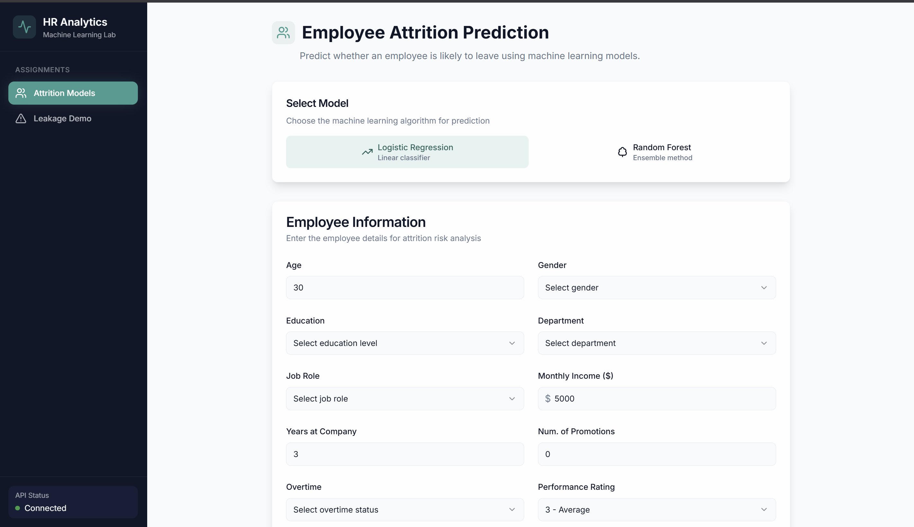

# Machine Learning Assignment Collection

Hey there! This repository contains three machine learning assignments that showcase different aspects of building, debugging, and optimizing ML models for employee analytics. Each assignment tackles a unique challenge and demonstrates practical skills in data science and model development.


# I also did deploy the entire Project here you can go through this URL : 

http://13.232.34.120:8080/

## Installation and Running:
### Easy method
```bash
# Just run the following command 
 .\run.bat
 or 
 run.bat
# This command will automatically install all the Requirements and start 2 Server
```
### Little Complex
```bash
# BACKED 
pip install -r requirements.txt

python -m uvicorn main:app --reload

# Frontend in seperate Terminal
cd _frontend

npm install

npm run dev
```

### After running both open the URL : http://localhost:8080
you will see the Following page

### you can directly test here


## What's Inside

### Assignment 1: Employee Attrition Prediction
Built a classification model to predict which employees might leave the company. We tackled class imbalance using SMOTE, experimented with both small (300 employees) and large (3000 employees) datasets, and deployed the model as a FastAPI endpoint. The model helps HR teams identify at-risk employees before they leave.

**Key Skills:** Classification, SMOTE, Feature Engineering, Model Deployment

### Assignment 2: Debugging Data Leakage
Got handed a "perfect" model with 99% accuracy that was too good to be true. Spoiler alert: it was. We hunted down data leakage issues where the target variable was accidentally included in the training features. Fixed the pipeline, removed the leaky features, and built a reliable model with honest 82% accuracy that actually works in production.

**Key Skills:** Data Leakage Detection, Model Debugging, Pipeline Fixing, Critical Thinking

### Assignment 3: Employee Productivity Prediction
Started with a basic regression model predicting employee productivity and made it better. We engineered new features, experimented with different algorithms, and improved model accuracy from 95% to 99%. The project shows how feature engineering and model optimization can significantly boost performance.

**Key Skills:** Regression, Feature Engineering, Model Optimization, Performance Tuning

## How We Did It

Each assignment follows a similar workflow:
1. **Data Exploration** - Understanding what we're working with
2. **Feature Engineering** - Creating useful features from raw data
3. **Model Training** - Building and testing different approaches
4. **Evaluation** - Measuring what actually matters
5. **Deployment** - Making models usable through APIs (where applicable)

All notebooks are well-documented with explanations, visualizations, and step-by-step processes. We kept things practical and focused on real-world scenarios rather than just chasing metrics.

## Getting Started

Each assignment folder has its own detailed README with:
- Installation instructions
- Step-by-step running guide
- Expected outputs and results
- Visualizations and analysis

Just navigate to any assignment folder and follow along. Everything is designed to run smoothly and teach you something along the way.

## Quick Setup

```bash
# Clone the repo
git clone https://github.com/lokeshpanthangi/drift_ai.git
cd drift_ai

# Install common dependencies
pip install pandas numpy matplotlib seaborn scikit-learn imbalanced-learn joblib fastapi uvicorn

# Pick an assignment and dive in
cd assignment_1
# Follow the README in that folder
```

## Project Structure

```
drift_ai/
├── assignment_1/       # Attrition prediction with SMOTE
├── assignment_2/       # Debugging and fixing data leakage
├── assignment_3/       # Productivity prediction optimization
└── main.py            # Combined API endpoint for all assignments
```

## Thanks

Thanks for the opportunity to work on these assignments! They were a great mix of practical challenges that really test your understanding of machine learning beyond just running models. Hope you enjoy going through each one as much as I enjoyed building them.

Feel free to explore each assignment folder for detailed documentation, code, and results. Happy exploring!
