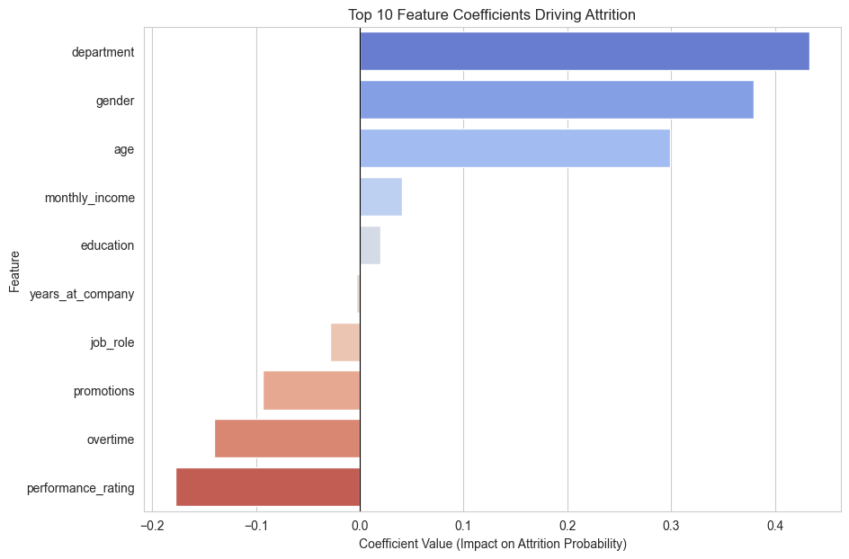
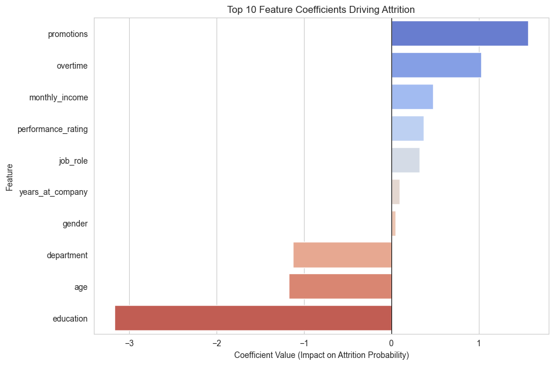

# Employee Attrition Prediction

## What is this project?
This project helps predict which employees might leave the company. We analyze data from 300 employees and build models to identify who is likely to quit.

## What you need
- Python 3.8 or higher
- Jupyter Notebook

## How to install

1. Download this project to your computer

2. Install the required tools:
```bash
pip install pandas numpy matplotlib seaborn scikit-learn imbalanced-learn
```

3. Make sure these files are in the right place:
   - `csv/attrition.csv` (300 employees)
   - `csv/employee_attrition.csv` (3000 employees)

## How to run the project

**Option 1: Use the small dataset (300 employees)**
- Open `notebooks/train.ipynb`
- Run all cells from top to bottom
- Takes 2-3 minutes

**Option 2: Use the large dataset (3000 employees)**
- Open `notebooks/train_newdata.ipynb`
- Run all cells from top to bottom
- Takes 3-5 minutes

**Option 3: Create your own dataset**
- Open `notebooks/make_mock_dataset.ipynb`
- Run all cells to make a new `employee_attrition.csv` file

## Important features that predict who will leave

### Features from the original dataset (300 employees)


### Features from the larger dataset (3000 employees)


## About the data

**Original Dataset:**
- 300 employees total
- 231 stayed (77%)
- 69 left the company (23%)
- No missing information

**What we looked at:**
- Age, income, years at company
- Department (HR, Sales, etc.)
- Job role (Executive, Manager, Lead)
- Education level
- Overtime work
- Gender
- Promotions and performance ratings

## How we prepared the data

**1. Encoding categories:**
- Simple categories (Department, Gender, Overtime) → OneHot Encoding
- Ordered categories (Education, Job Role) → Ordinal Encoding
- Numbers (Age, Income, Years) → Standard Scaling

**2. Splitting data:**
- 70% for training the model
- 30% for testing the model

**3. Fixing imbalanced data:**
- Used SMOTE technique to create more examples of employees who left
- This helps the model learn better

## Models we tested

We tested 4 different versions:

1. **Logistic Regression** - without SMOTE
2. **Logistic Regression** - with SMOTE
3. **Random Forest** - without SMOTE
4. **Random Forest** - with SMOTE

## Results

### Small Dataset (300 employees)

| Model | SMOTE | Accuracy | Recall | F1 Score |
|-------|-------|----------|--------|----------|
| Logistic Regression | No | 51% | 32% | 0.24 |
| Logistic Regression | Yes | 58% | 45% | 0.34 |
| Random Forest | No | 77% | 5% | 0.09 |
| Random Forest | Yes | 73% | 5% | 0.08 |

**Winner:** Logistic Regression with SMOTE
- Could identify 45% of employees who actually left
- Random Forest had higher accuracy but missed most people who left

### Large Dataset (3000 employees)

| Model | SMOTE | Accuracy | Recall | F1 Score |
|-------|-------|----------|--------|----------|
| Logistic Regression | Both | 85% | 83% | 0.85 |
| Random Forest | Both | 90% | 90% | 0.90 |

**Winner:** Random Forest with SMOTE
- 90% accuracy
- Works much better with more data

## What increases the chance someone will leave?

1. **Working overtime** - biggest factor
2. **Executive job role**
3. **Working in HR department**
4. **Lower income**
5. **Fewer promotions**

## What keeps employees staying?

1. **Higher salary** - most important
2. **More promotions**
3. **Better performance ratings**
4. **Older age**
5. **Higher education (PhD)**
6. **Lead positions**

## What we learned

1. **More data = better results:** With 300 employees, accuracy was 58%. With 3000 employees, accuracy jumped to 90%.

2. **Simple models work better with less data:** Logistic Regression was best for small dataset. Random Forest was best for large dataset.

3. **SMOTE helps with imbalanced data:** It improved results significantly when we had few examples of people leaving.

4. **Overtime is the biggest problem:** Employees working overtime are most likely to quit.

5. **Money matters:** Higher income and more promotions keep people from leaving.

6. **HR department needs attention:** HR has the highest rate of people leaving.

## Tools used

- pandas - working with data
- numpy - calculations
- matplotlib & seaborn - charts and graphs
- scikit-learn - machine learning
- imbalanced-learn - SMOTE technique

## Saved models

After training, we saved these files:
- `logistic_smote_model.pkl` - Logistic Regression model
- `rand_smote_model.pkl` - Random Forest model
- `transformer.pkl` - Tool for preparing new data