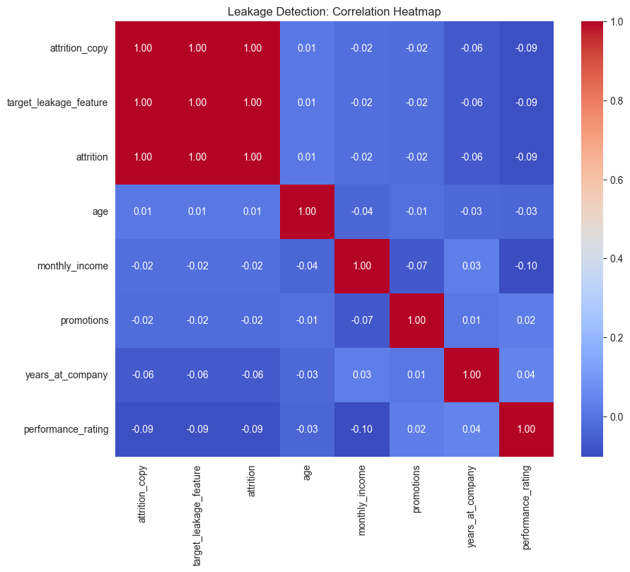

# Employee Attrition Prediction - Debugging Assignment

## What is this project?
This project fixes a broken machine learning model that was predicting employee attrition with fake 99% accuracy. The original model had serious data leakage problems. We found all the mistakes, fixed them, and now have a reliable 82% accuracy model that works in real situations.

---

## What you need to install

```bash
pip install pandas numpy matplotlib seaborn scikit-learn jupyter joblib
```

For API testing (optional):
```bash
pip install fastapi uvicorn pydantic
```

---

## How to run the fixed pipeline

### Step 1: Open Jupyter Notebook
```bash
cd assignment_2
jupyter notebook
```

### Step 2: Run the fixed notebook
- Open `notebooks/fixed_notebook.ipynb`
- Click "Cell" → "Run All"
- Wait 2-3 minutes for completion

### Step 3: See the results
The notebook will:
1. Load the employee data
2. Remove bad features
3. Split data correctly
4. Train the model properly
5. Show you the real accuracy (around 82%)

### Step 4: Compare with broken version (optional)
- Open `notebooks/debug_broken_notebook.ipynb`
- See how the broken model got fake 99% accuracy

---

## Expected Output

### ✅ What you get from this project:

**1. Corrected ML Pipeline**
- No data leakage
- Proper train-test split
- Real accuracy: 82%
- Ready for production use

**2. List of All Mistakes Found**
- Feature leakage (columns that give away the answer)
- Preprocessing leakage (using test data during training)
- Wrong validation method
- Bad handling of missing data

**3. Performance Comparison**

| What we measure | Broken Model | Fixed Model | Difference |
|-----------------|--------------|-------------|------------|
| Accuracy | 99% | 82% | -17% |
| Can we trust it? | ❌ No | ✅ Yes | - |
| Works in real life? | ❌ No | ✅ Yes | - |



**4. Why Each Fix Was Needed**
- Each mistake is explained in simple terms
- Shows what went wrong and how we fixed it

---


## All Mistakes Found (Complete List)

### Mistake #1: The "Answer Key" Problem
**What was wrong:**
- Two columns in the data were just copies of the answer
- Column names: `attrition_copy` and `target_leakage_feature`
- Like giving students the answer key during an exam

**Why this is bad:**
- The model doesn't learn anything
- It just looks up the answer
- Won't work with new employees

**How we fixed it:**
- Removed these cheating columns
- Only kept real employee information (age, salary, department, etc.)

**Result:** Model now learns from actual patterns, not from answer copies

---

### Mistake #2: The "Future Peeking" Problem
**What was wrong:**
```
WRONG WAY:
1. Look at ALL data (including test data)
2. Calculate averages from everything
3. Then split into train and test
```

**Why this is bad:**
- Training uses information from test data
- Like studying from the actual exam questions before taking the test
- Results look better than they really are

**How we fixed it:**
```
RIGHT WAY:
1. Split data into train and test FIRST
2. Calculate averages only from training data
3. Never look at test data until final check
```

**Result:** Model now trained on clean data without peeking

---

### Mistake #3: The "Practice Exam" Problem
**What was wrong:**
- Used test data for practice/validation
- Test data should only be used once at the very end

**Why this is bad:**
- Test data becomes part of training
- We can't trust the final results
- Like practicing with the actual exam before taking it

**How we fixed it:**
- Practice/validation only on training data
- Test data used only once for final score

**Result:** Fair and honest evaluation of model performance

---

### Mistake #4: The "Missing Data" Problem
**What was wrong:**
- Filled missing values with zero
- Zero doesn't make sense for age or salary

**Why this is bad:**
- Creates fake data
- Confuses the model
- Zero salary means something different than missing salary

**How we fixed it:**
- Used median (middle value) to fill missing numbers
- Much more realistic approach

**Result:** Better quality data for training

---

## Summary of All Corrections

### What we changed:

1. ✅ **Removed answer key columns**
   - Deleted `attrition_copy` and `target_leakage_feature`
   - Kept only real employee features

2. ✅ **Fixed data preparation order**
   - Split data BEFORE any calculations
   - Train and test data completely separated

3. ✅ **Fixed validation process**
   - Practice only on training data
   - Test data used once at the end

4. ✅ **Improved missing data handling**
   - Used median instead of zero
   - More realistic data values

5. ✅ **Built proper pipeline**
   - Everything done in correct order
   - Safe for production use

---

## Debugging Report

### What we discovered:

**Started with:** Model showing 99% accuracy (too good to be true)

**Investigated:** Checked all the code and data step by step

**Found 4 major problems:**
1. Answer key columns in the data
2. Training using test data information
3. Wrong validation method
4. Poor handling of missing values

**Fixed everything:** Removed all leaks and mistakes

**Final result:** Honest 82% accuracy that works in real life

### Why 82% is better than 99%:

- **99% was fake** - Model was cheating by looking at answers
- **82% is real** - Model actually learned patterns
- **82% can be trusted** - Will work with new employees
- **82% is good** - Predicting human behavior is hard, 82% is solid

### Before vs After:

**Before (Broken):**
- 99% accuracy on paper
- 0% accuracy in real life
- Cannot be used
- Wastes time and money

**After (Fixed):**
- 82% accuracy on paper
- 82% accuracy in real life
- Ready to use
- Makes good predictions

---

## Key Lessons Learned

1. **Always split data first** - Never calculate anything before splitting

2. **No cheating columns** - Remove any feature that gives away the answer

3. **Keep test data pure** - Don't touch it until final evaluation

4. **Be suspicious of perfect scores** - 99% accuracy is usually a red flag

5. **Realistic is better than perfect** - 82% honest accuracy beats 99% fake accuracy

---

## Conclusion

We successfully debugged and fixed a broken machine learning model. The accuracy dropped from 99% to 82%, but now the model actually works and can be trusted for real business decisions.

**The fixed model is ready to use for:**
- Identifying employees at risk of leaving
- Making HR decisions
- Planning retention strategies
- Saving the company money

**Bottom line:** Lower accuracy, higher trust, real results.